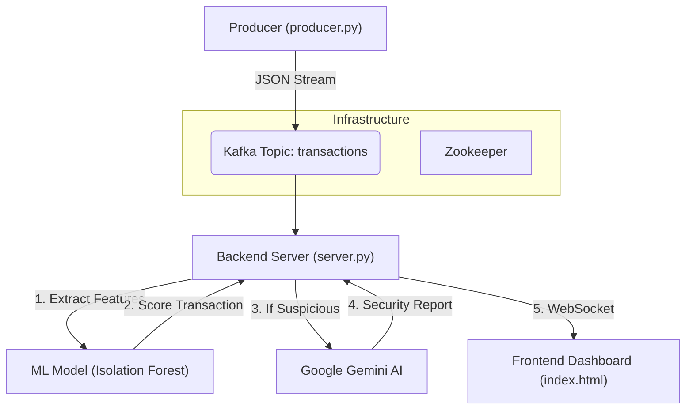

# 🛡️ FinSentinel - AI-Powered Fraud Detection System


FinSentinel is a **real-time financial fraud detection** mission control dashboard. It ingests high-velocity transaction streams via **Apache Kafka**, uses an **Isolation Forest (ML)** algorithm to detect anomalies, and leverages **Google Gemini AI** to investigate suspicious activities in real-time, providing human-readable security reports.

---

## 🏗️ Architecture

The system consists of three main components: a Data Producer, a Real-time Analysis Backend, and a Frontend Dashboard.



## ✨ Key Features
- **🚀 Real-Time Processing**: Handles continuous streams of financial data.
- **🧠 Hybrid AI Approach**:
  - **Machine Learning**: Fast, statistical outlier detection (Isolation Forest).
  - **Generative AI**: qualitative analysis and reasoning (Gemini Flash).
- **🎨 Mission Control UI**: Cyberpunk-styled dashboard with real-time feeds, sound alerts (concept), and visual analytics.
- **🐳 Dockerized**: Easy deployment of the Kafka infrastructure.

---

## 📂 Project Structure
```bash
FinSentinel/
├── docker-compose.yml   # Kafka & Zookeeper setup
├── producer.py          # Simulates transaction traffic (Safe & Fraud)
├── server.py            # FastAPI Backend + Kafka Consumer + AI Logic
├── train_model.py       # Trains the ML model on synthetic data
├── detecter.py          # Standalone CLI detection script
├── index.html           # Frontend Mission Control Dashboard
├── fraud_model.pkl      # Saved ML Model (generated after training)
├── .env                 # API Keys config
└── requirements.txt     # Python Dependencies
```

---

## ⚡ Quick Start Guide

### 1. Prerequisites
- **Docker Desktop** (running)
- **Python 3.9+**
- **Google Gemini API Key** (Get it [here](https://aistudio.google.com/))

### 2. Infrastructure Setup (Kafka)
Start the message broker services:
```bash
docker-compose up -d
```
*Wait ~30 seconds for Kafka to initialize.*

### 3. Environment Config
1. Create a `.env` file in the root directory:
```bash
# Windows
type NUL > .env
# Mac/Linux
touch .env
```
2. Add your API Key:
```ini
GEMINI_API_KEY=your_actual_api_key_here
```

### 4. Install Dependencies
```bash
python -m venv venv
# Activate Venv
# Windows:
venv\Scripts\activate
# Mac/Linux:
source venv/bin/activate

pip install -r requirements.txt
```

### 5. Train the Anomaly Detector
Generate synthetic data and train the Isolation Forest model:
```bash
python train_model.py
```
*Output: `✅ New Model Saved!`*

### 6. Run the System
You need to run **three** terminals simultaneously.

**Terminal 1: Backend Server**
```bash
uvicorn server:app --reload
```
*Listens on ws://localhost:8000/ws*

**Terminal 2: Data Producer**
```bash
python producer.py
```
*Sends 1 transaction every 5 seconds.*

**Terminal 3 (Optional): CLI Detector**
If you want to see logs in the terminal instead of the web UI:
```bash
python detecter.py
```

### 7. Launch Dashboard
Simply open `index.html` in your web browser.
- The dashboard will connect to `ws://localhost:8000/ws`.
- Log in with "Agent ID" (any text) and "Passkey" (any text).
- Watch the transactions flow in!

---

## 🖼️ Dashboard Preview

> *Add screenshots here by placing images in an `assets` folder and linking them.*

**Normal State:**
System monitors transactions. Green indicators.

**Fraud Alert:**
When a refined Fraud transaction (>$2000 & Anomaly) is detected:
1. The UI shifts to **Red Alert**.
2. Gemini AI generates a report explaining the risk.
3. "Freeze Account" options appear.

---

## 🛠️ Troubleshooting

- **Kafka Connection Error?**
  - Ensure Docker is running.
  - Run `docker ps` to check if `kafka` and `zookeeper` are healthy.
- **Model Error?**
  - Ensure you ran `python train_model.py` successfully.
- **API Key Error?**
  - Check your `.env` file name and content.
